<style type="text/css">
 caption {
      font-size: 1em;
      color: black;
 } 
 h1 {
  font-size: 20pt;
 }
 h2 {
  font-size: 18pt;
 }
 h3 {
  font-size: 16pt;
 }
</style>

**Author**: Michael Letheby

**Date**: 12^th^ June 2020

# Introduction

The aim of this task was to undertake an __exploratory analysis__ of a __"skinny" dataset__ (one with a small number of variables). To progress through the task I would need to think creatively and develop my own questions about the data. As a base I used a dataset of U.S Baby Names from the US Social Security Administration (SSA).

The intention of this report was to explain my thought process at each stage of the process. The focus was on exploratory data analysis (EDA) and there were no modelling or predictive elements.

The tools used to complete this analysis were R and R Markdown. I've hidden most of the code in the published document for the sake of readability but the complete code can be found on my [Github](https://github.com/OnlyBuilt4CubanLinux/US_Baby_Names).

## About the Dataset

The link to the original dataset can be found [here](https://www.ssa.gov/oact/babynames/limits.html) and contains the names of babies registered with the SSA in the U.S between the years 1880-2018. Only names with 5+ occurrences in a given year are contained within the dataset to protect privacy.

For this analysis I made the decision to subset the dataset to the 1,000 most popular names for each gender^[Ranking is based on frequency per year and gender. Where counts are tied rankings are assigned alphabetically]. This decision was made to speed up the analysis as I was running R locally^[An alternative would have been to perform calculations on a yearly basis and continually aggregate]. This should be kept in mind when interpreting results as the population is therefore not equivalent to that of all babies born in the US (although trends will be broadly similar). 


## Libraries

I used the following packages in R for this project. There are many different ways of working with data in R but I have chosen to use these based on personal preference and experience. 


```r
# General Data Manipulation
library(corrplot) # For visualising basic correlation relationships
library(kableExtra) # CSS table formatting
library(lubridate) # For working with datetime variables
library(RColorBrewer) # Additional colour palettes
library(scales) # Number formats and transformations
library(tidyverse) # General data manipulation and visualisation
```


# Importing the dataset

In this section I imported the provided data and developed questions I could explore in more detail.

## Importing files

The raw data was provided by the SSA in the form of CSV files with data formatted as below:  
Emma,F,18688  
Olivia,F,17921

Based on this information I could infer that the data contains 3 fields:

* __Name__: the baby's first name.
* __Gender__: the baby's gender.
* __Count__: the count of babies registered with the same first name and gender within that year.

I had to explicitly declare my variable types when importing as the Gender column contains the value "F" which causes R to import the field as a logical boolean.

## Time Variable

A notable field missing in the provided files was a time variable. In order to perform time-series analysis I added a __"Year" variable__ by extracting the information from the CSV filenames. 

## Finding a starting point

Looking at the dataset there were lots of questions I could explore: 

* What does the __distribution of names__ look like?
* Has the __length of names__ changed over time?
* How does the __popularity of names__ change over time?
* Can __popular individuals__ cause meaningful __changes in naming behaviour__?
* What __first letters__ do most names begin with?

I was more interested in looking at questions relating to the popularity of names over time so I chose to focus on that. The raw markdown file on [Github](https://github.com/OnlyBuilt4CubanLinux/US_Baby_Names) contains the fields needed to answer questions about name length and letter frequency.

Although the report is set out in a linear fashion I came up with the questions and solutions in an iterative manner.


# Exploring the dataset

## Distribution of names

Throughout my life I've always felt like every other person I meet has the same name as me. With the commonness of my own name in mind I wanted to investigate:

* How __evenly distributed are names__? 
* Has the __distribution of names changed over time__?

To start with I looked at the distribution of names across a single year, 2018, and split this by Gender. To review the distribution I also needed to add a __"Position"__ field to rank the popularity of each name. A Position value of 1 indicates that a particular name within a given time period is the most common.

<div class="figure" style="text-align: center">
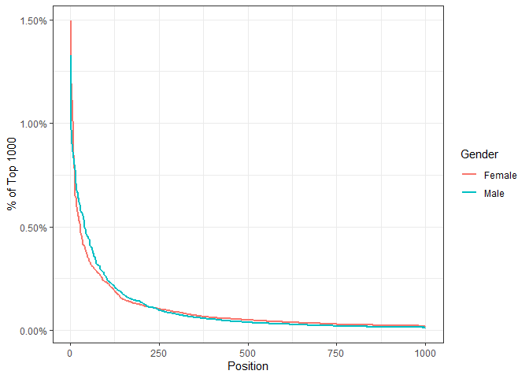
<p class="caption">(\#fig:NameSingle-Plot)Name Distribution - 2018</p>
</div>

Figure \@ref(fig:NameSingle-Plot) showed that names are highly skewed for both Males and Females (i.e. the distribution of names is strongly weighted towards the most popular names). To make this relationship clearer I re-plotted the data using a cumulative distribution and added a reference line at the 100th position. 

<div class="figure" style="text-align: center">
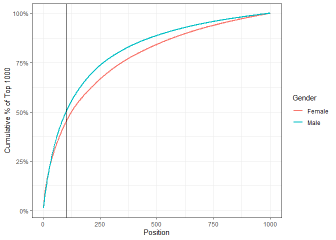
<p class="caption">(\#fig:NameSingleCumulative-Plot)Cumulative Name Distribution - 2018</p>
</div>


From Figure \@ref(fig:NameSingleCumulative-Plot) I could see that the top 100 names make up 45% and 50% of names^[Of the Top 1,000 subset] for females and males respectively. As already observed from the Figure \@ref(fig:NameSingle-Plot) the distribution of names in 2018 is heavily weighted towards the most popular names.

While this is was an interesting insight I only explored a single year of data and there are 138 of them to analyse. 

To see whether the concentration of names has changed since 1880 I looked at how the median "Position" changed over time for each "Gender".


<div class="figure" style="text-align: center">
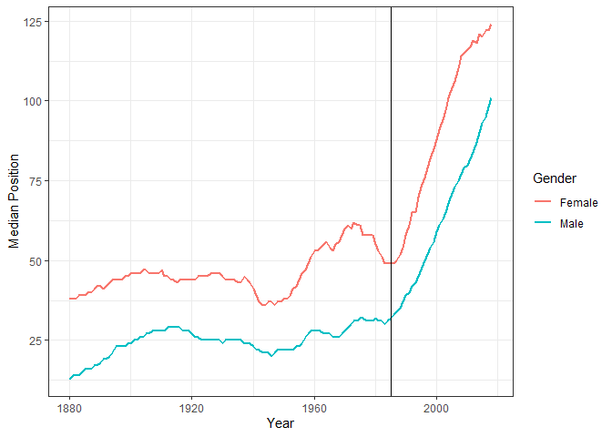
<p class="caption">(\#fig:MedianName-Plot)Median Name Position</p>
</div>

From Figure \@ref(fig:MedianName-Plot) I could see that the median "Position" for both genders increased relatively slowly until ~1985 and then experienced a dramatic rise.

To get a better idea about the shape of the distributions I also plotted the 25^th^, 50^th^ (Median) and 75^th^ percentiles. This gave me a better idea of the distribution shape of names over time. I also split the graph by "Gender" to reduce the amount of information appearing on a single plot.

<div class="figure" style="text-align: center">
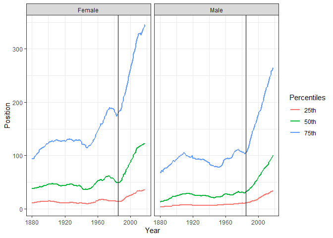
<p class="caption">(\#fig:NamePercentiles-Plot)Position Percentiles Split by Gender</p>
</div>

From Figure \@ref(fig:NamePercentiles-Plot) graph I could observe:

* Overall the __distribution__ of baby names across __both genders__ has become __less skewed__ over time.
* The 25^th^ Percentile has not risen at the same rate as the 50^th^ and 75^th^ Percentile. This shows that names are still heavily weighted towards the most popular names but that there is increasing diversity^[The term "diversity" here really means less concentrated given the number of names is fixed at 1,000 in each year of data] across the less common names.
* We can also observe that that __Female names have greater diversity compared to Males__.

The drivers of these changes could include:

* Increased immigration over time driving names from different ethnic backgrounds.
* Cultural shifts leading parents to desire unique names.
* Increased use of variations of names (e.g. Caitlin, Kaitlin, Caitlyn).

Drawing a conclusion on these drivers is outside the scope of this analysis but I may attempt to explore them in a future exercise.

## Classifying name trend behaviour

I looked at the behaviour of individual names over time and investigated ways to group them together in a systematic way. To start with I extracted the top 10 names in 1880 and 2018 and looked for overlap.


<table class="table table-striped" style="width: auto !important; float: left; margin-right: 10px;">
<caption>(\#tab:Top10Table)Top 10 Names 1880</caption>
 <thead>
  <tr>
   <th style="text-align:right;"> Position </th>
   <th style="text-align:left;"> F </th>
   <th style="text-align:left;"> M </th>
  </tr>
 </thead>
<tbody>
  <tr>
   <td style="text-align:right;"> 1 </td>
   <td style="text-align:left;"> Mary </td>
   <td style="text-align:left;"> John </td>
  </tr>
  <tr>
   <td style="text-align:right;"> 2 </td>
   <td style="text-align:left;"> Anna </td>
   <td style="text-align:left;"> William </td>
  </tr>
  <tr>
   <td style="text-align:right;"> 3 </td>
   <td style="text-align:left;"> Emma </td>
   <td style="text-align:left;"> James </td>
  </tr>
  <tr>
   <td style="text-align:right;"> 4 </td>
   <td style="text-align:left;"> Elizabeth </td>
   <td style="text-align:left;"> Charles </td>
  </tr>
  <tr>
   <td style="text-align:right;"> 5 </td>
   <td style="text-align:left;"> Minnie </td>
   <td style="text-align:left;"> George </td>
  </tr>
  <tr>
   <td style="text-align:right;"> 6 </td>
   <td style="text-align:left;"> Margaret </td>
   <td style="text-align:left;"> Frank </td>
  </tr>
  <tr>
   <td style="text-align:right;"> 7 </td>
   <td style="text-align:left;"> Ida </td>
   <td style="text-align:left;"> Joseph </td>
  </tr>
  <tr>
   <td style="text-align:right;"> 8 </td>
   <td style="text-align:left;"> Alice </td>
   <td style="text-align:left;"> Thomas </td>
  </tr>
  <tr>
   <td style="text-align:right;"> 9 </td>
   <td style="text-align:left;"> Bertha </td>
   <td style="text-align:left;"> Henry </td>
  </tr>
  <tr>
   <td style="text-align:right;"> 10 </td>
   <td style="text-align:left;"> Sarah </td>
   <td style="text-align:left;"> Robert </td>
  </tr>
</tbody>
</table>

<table class="table table-striped" style="width: auto !important; ">
<caption>(\#tab:Top10Table)Top 10 Names 2018</caption>
 <thead>
  <tr>
   <th style="text-align:right;"> Position </th>
   <th style="text-align:left;"> F </th>
   <th style="text-align:left;"> M </th>
  </tr>
 </thead>
<tbody>
  <tr>
   <td style="text-align:right;"> 1 </td>
   <td style="text-align:left;"> Emma </td>
   <td style="text-align:left;"> Liam </td>
  </tr>
  <tr>
   <td style="text-align:right;"> 2 </td>
   <td style="text-align:left;"> Olivia </td>
   <td style="text-align:left;"> Noah </td>
  </tr>
  <tr>
   <td style="text-align:right;"> 3 </td>
   <td style="text-align:left;"> Ava </td>
   <td style="text-align:left;"> William </td>
  </tr>
  <tr>
   <td style="text-align:right;"> 4 </td>
   <td style="text-align:left;"> Isabella </td>
   <td style="text-align:left;"> James </td>
  </tr>
  <tr>
   <td style="text-align:right;"> 5 </td>
   <td style="text-align:left;"> Sophia </td>
   <td style="text-align:left;"> Oliver </td>
  </tr>
  <tr>
   <td style="text-align:right;"> 6 </td>
   <td style="text-align:left;"> Charlotte </td>
   <td style="text-align:left;"> Benjamin </td>
  </tr>
  <tr>
   <td style="text-align:right;"> 7 </td>
   <td style="text-align:left;"> Mia </td>
   <td style="text-align:left;"> Elijah </td>
  </tr>
  <tr>
   <td style="text-align:right;"> 8 </td>
   <td style="text-align:left;"> Amelia </td>
   <td style="text-align:left;"> Lucas </td>
  </tr>
  <tr>
   <td style="text-align:right;"> 9 </td>
   <td style="text-align:left;"> Harper </td>
   <td style="text-align:left;"> Mason </td>
  </tr>
  <tr>
   <td style="text-align:right;"> 10 </td>
   <td style="text-align:left;"> Evelyn </td>
   <td style="text-align:left;"> Logan </td>
  </tr>
</tbody>
</table>


Of the Top 10 names in 1880, 2 male names and 1 female name remain in the Top 10 as of 2018. Next I plotted the "Position" of the Top 10 Female names from 1880 over time to see how their popularity changed.

<div class="figure" style="text-align: center">
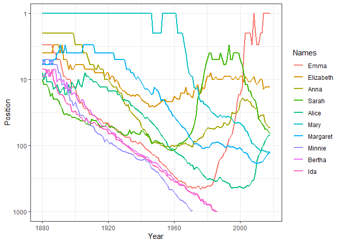
<p class="caption">(\#fig:Top10Female-Plot)Top 10 Female Names of 1880</p>
</div>

Looking at Figure \@ref(fig:Top10Female-Plot) (and noting that the Y-Axis is using a log10 scale) several trends were apparent:

* __Ida__ has continuously decreased in popularity each year, dropping out of the top 1,000 around late 1960/early 1970.
* __Elizabeth__ has remained relatively stable over the entire period.
* __Emma__ was decreasing in popularity between 1880-1970 but had a dramatic return to popularity ending as the most popular female name by the end of the observation period.

I replotted the data again with just these 3 names and removed the log10 transformation on the y-axis to make the relative movements of each name clearer.

<div class="figure" style="text-align: center">
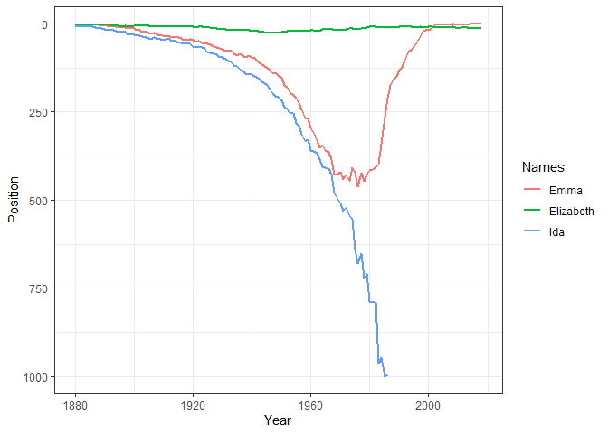
<p class="caption">(\#fig:Top10FemaleSubset-Plot)Top 10 Female Names of 1880 (Subset)</p>
</div>

My next step was to identify a way to systematically extract names that perform in a similar manner rather than trying to find them manually. I tried several different methods to do this including classifying the behaviour based on grids but ultimately went with a simpler option.

From Figure \@ref(fig:Top10FemaleSubset-Plot) I can largely identify the behaviour of each name from four basic pieces of information:

* __Start Position__
* __End Position__
* __Minimum Position__
* __Maximum Position__

Using these datapoints I can define the behaviour of the three examples above:

* __Ida__ is a name that has __fallen out of favour__; the Ending Position is higher than the Starting position and has a low variation between Starting Position and Minimum and between Ending Position and Maximum. 
* __Elizabeth__ is a __stable__ name; the variation between Maximum and Minimum Positions is low. 
* __Emma__ is a name that has __returned to popularity__; it has a low variation between Starting and Ending Position and a large variation between the Maximum and Minimum.

These kind of relationships will not always work, a sinusoidal pattern for example, but should be accurate enough for this task. I filtered these groupings based on the values of their Starting or Ending Position to get more meaningful movements. It should also be noted there are other kinds of patterns that are missing, such as names that have continuously become more popular.


<div class="figure" style="text-align: center">
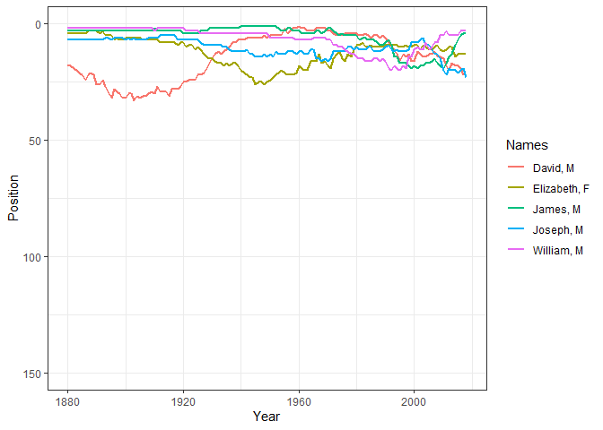
<p class="caption">(\#fig:StablePopularNames-Plot)Stable and Popular Names</p>
</div>

If these names were a song they'd be "Never Change" by Jay-Z and like Hov himself they have sustained their popularity over a long period. Figure \@ref(fig:StablePopularNames-Plot) displays names with low variation (stable) that finished within the top 25 names in 2018 (popular). I manually restricted the Y-axis range to 0-150 to make the trend clearer. As expected the name __Elizabeth__ appeared in this grouping.


<div class="figure" style="text-align: center">
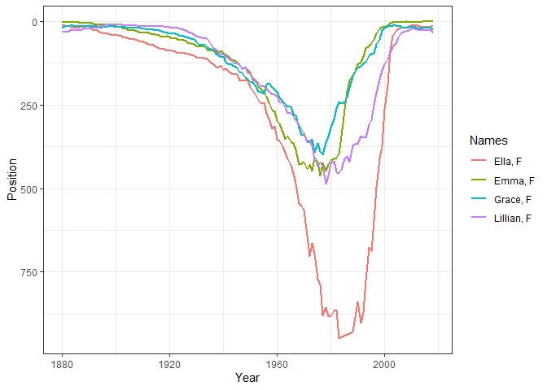
<p class="caption">(\#fig:PopCycleNames-Plot)Popular and Cyclical Names</p>
</div>

Figure \@ref(fig:PopCycleNames-Plot) shows names that started and ended popular but also had large variations (i.e. falls from popularity). It was interesting to note all of the names were female but this may have been a coincidence due to the parameters chosen. The name __Emma__ from the initial investigation is also present as expected.


<div class="figure" style="text-align: center">
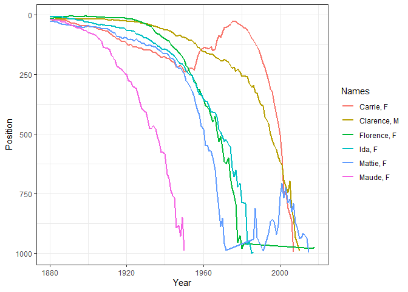
<p class="caption">(\#fig:Unpopular-Plot)Out of Fashion Names</p>
</div>

Out of fashion names are ones that started popular but had steady declines over time. I've filtered the greatest falls here to limit the amount of names that appear. The name __Ida__ appears in this grouping as expected. The name Carrie appears to lose popularity in 1975, right around the release of a particular movie based on a Stephen King novel. The behaviour of the name Carrie aligns nicely with the next question I explored in Section \@ref(names-that-entered-the-zeitgeist).


Another trend that would have been interesting to investigate was the rise of names entering the top 1,000. Plotting this with "Year" on the X-axis would be hard to interpret due to names appearing at different points (this can be seen in the raw R Markdown document). The X-axis time period should be transformed to become Years since entry to ensure a consistent frame of reference (which is similar to how vintage analysis graphs work).

## Names that entered the zeitgeist

After hearing a Dad call out to his daughter Khaleesi^[An honorific given to one of the main characters in Game of Thrones/ A Song of Ice and Fire] I was curious to know how common it was for babies to be named after famous people/characters. Could a __blockbuster movie__ cause a __blockbuster increase in name popularity__? Should I expect to meet a fresh graduate called Thanos in a few decades? To investigate whether this was the case I looked for __names__ in my dataset that had an __immediate and large increase__ in their popularity.

To begin with I created new variables to calculate change in "Count" and "Position" and then graphed this relationship using a hex plot. A hex plot is similar to a scatter plot but provides an additional density overlay which is useful for graphs with a large amount of observations.


<div class="figure" style="text-align: center">
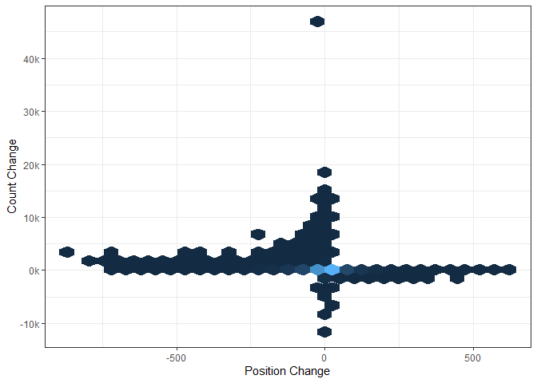
<p class="caption">(\#fig:YoYMove-Plot)YoY Movements in Names</p>
</div>

I like to plot data (no matter how ugly) to provide a leaping off point for further exploration. Figure \@ref(fig:YoYMove-Plot) is hard to read but provided ideas about where to go next: 

* There are a lot of names which experienced very high increases in "Position".
* There seems to be an outlier with a YoY change of 40K+. I investigated to ensure there was no issue in the logic used to create the fields. The observation belongs to the name Linda in 1947. 
* Additional parameters need to be defined as there is too much data at the moment. 

Note that I suppressed the legend in Figure \@ref(fig:YoYMove-Plot) as it's not overly useful, a lighter blue indicates more observations in the hex.


I plotted the graph again after filtering for names that increased in "Position" by more than 200 positions and had a "Count" change of more than 1,000 (to reduce noise). Since the volume of observations decreased I used a scatter plot instead of a hex plot.

<div class="figure" style="text-align: center">
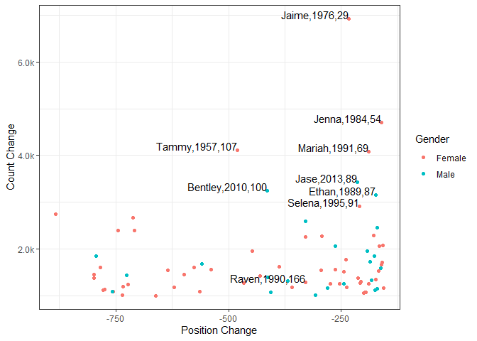
<p class="caption">(\#fig:YoYMoveSubset-Plot)YoY Movements in Names (Subset)</p>
</div>

For Figure \@ref(fig:YoYMoveSubset-Plot) I added labels to display the "Name", "Year" and "Position" of observations where the volume change was >2800 (and one for the name Raven) to make them easier to read on the graph.

I chose 3 names here to investigate further:

* __Raven__, Female, 1990 because I had my own theory on the cause.
* __Bentley__, Male, 2010 because I recognise the car brand but had no idea it was such a popular baby name.
* __Jaime__, Female, 1976 because it has the largest volume change in this subset of data^[I also investigated Linda but excluded it from the report. The potential causes are quite easy to theorise when looking at the time period.

I selected the name Raven to look at first because it's an unusual name and one I had my own theory on. I thought the increase could be caused by the actress Raven-Symone who was the star of one of my favourite childhood shows, That's So Raven.

Firstly I plotted "Count" over time for the name Raven.

<div class="figure" style="text-align: center">
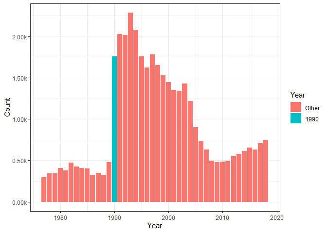
<p class="caption">(\#fig:RavenYoY-Plot)That's so Raven?</p>
</div>

From Figure \@ref(fig:RavenYoY-Plot) I can see that the name Raven had an initial spike in popularity in 1990 which was sustained for several years before beginning to decline in the mid-2000s. My personal theory that the increase was caused by the show That's So Raven was not looking good given that particular show premiered in 2003^[I had misremembered this as being a much older show than it was]. 

Further investigation revealed that in 1989 Raven-Symone (at the age of 4) became a regular cast member of The Cosby Show. I was confident this event could be identified as the cause based on the fact The Cosby Show was massively popular during its runtime and a lack of any convincing alternatives. The actress Raven-Symone appears to be the namesake inspiration for several thousand children between 1990 until the mid-2000s (take that Edgar Allen Poe).

With Raven out of the way I looked at the remaining 2 names, starting with Bentley.

<div class="figure" style="text-align: center">
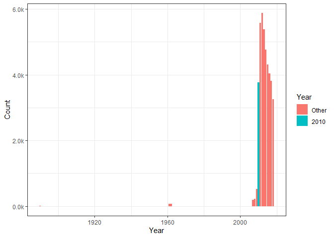
<p class="caption">(\#fig:BentleyYoY-Plot)Bentley</p>
</div>

The observation point about Bentley was one that drew my eye as I was aware of the car brand but surprised at how popular the name was after 2010 (where it entered the top 100 male names). Looking online I initially couldn't find any compelling reasons for this trend unless the 148th anniversary of Great Expectations was more influential than I thought. 

> Was this a case of "Couldn't afford a car so she named her daughter Alexus" as foretold by Kanye West? 

However some further googling uncovered that the reality show "16 and Pregnant" premiered in 2009 and prominently featured a baby called Bentley. This show was extremely popular during its time and lead to a number of spin-offs. The show "16 and Pregnant" may have been behind the dramatic increase in popularity as the time-line matches up well and I couldn't find any other competing theories.

<div class="figure" style="text-align: center">
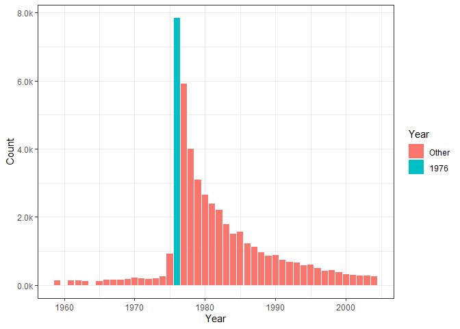
<p class="caption">(\#fig:JaimeYoY-Plot)Jaime</p>
</div>

Figure \@ref(fig:JaimeYoY-Plot) showed the name Jaime had a surge in popularity in 1976. Research shows that the character Jaime Sommers (a.k.a The Bionic Woman) first appeared on "The Six Million Dollar Man" in 1975 and then appeared in her own titular show in 1976. This seems like a convincing driver behind the increase in popularity in the name Jaime.

So far it appears all 3 of the names I reviewed have been triggered by pop-culture events^[I also investigated the name Khaleesi which is visible in the raw markdown document]. This lead me to wonder, are names that leap into the public conscious a trend that changes over time?


To begin I needed to introduce some basic parameters so I don't end up with more noise than a Death Grips concert. I looked for names that changed their "Position" by more than 150 in a single year (large increase) and finished within the top 200 names (entered popular territory).


```
## Adding missing grouping variables: `Gender`
```

<div class="figure" style="text-align: center">
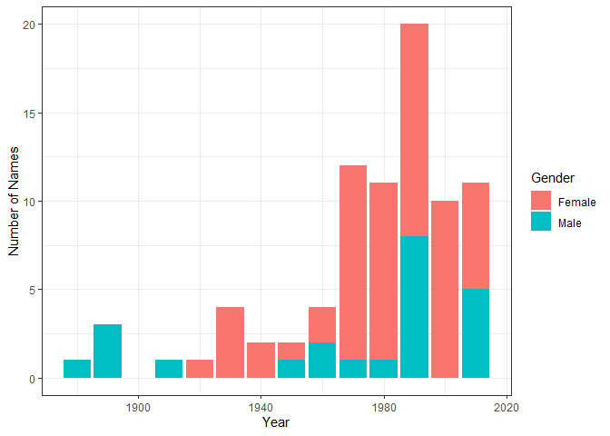
<p class="caption">(\#fig:NamesZeitgeist-Plot)Names that leapt into the top 200</p>
</div>

As the volumes are quite small I grouped the years into decades to make the trends easier to see. Figure \@ref(fig:NamesZeitgeist-Plot) showed the volume of names leaping into popularity increased significantly from the 1960s and primarily influenced female names. 

In terms of drivers there isn't enough information here to conclude that all these shifts are due to the media. However some studies^[Napierski-Prancl, M. (2016). Brandy, You're a Fine Name: Popular Music and the Naming of Infant Girls from 1965-1985. Studies in Popular Culture, 38(2), 41-53.] do support the idea that popular media is a factor that influences naming behaviour. This would make sense as large changes in naming behaviour would require a large group of people to be exposed to the same idea at a particular time.

So while not a sure thing I won't be too surprised if I run into a young Thanos or T'Chaka in 20 years time.

# Other

## Full R Code

The entire R code for this analysis can be found on [Github](https://github.com/OnlyBuilt4CubanLinux/US_Baby_Names).

## Notes on R

This report was created using R Markdown with the code written in R and version control managed through Github. 

R is an excellent language for data analysis and modelling work. Alongside Python it is an open-source language with significant community support and is a powerful and flexible tool for data professionals. I highly recommend [R for Data Science](https://r4ds.had.co.nz/) by Garrett Grolemund and Hadley Wickham as a resource for beginners.

## Contact

If you'd like to get in touch please contact me at my [LinkedIn](https://www.linkedin.com/in/letheby/). All of my personal projects can be found at my [Github Page](https://onlybuilt4cubanlinux.github.io/).
